# Симуляция проекта Gowin при помощи ModelSim

## Структура папок

<pre>

Название проекта
├─ <b>.vscode</b> - папка с настройками VSCode
│   ├─ <b>settings.json</b> - Параметры для запуска симуляции и определение кнопок для простоты доступа.
│   └─ <b>tasks.json</b> - Описание задач для VSCode.
├─ <b>gw_prj</b> - пример наименования папки с проектом для FPGA
│   ├─ <b>src</b> - Папка с исходными файлами проекта.
│   │   ├─ <b>top.v</b> - <i>Top</i> модуль проекта Gowin.
│   │   ├─ <b>modelsim.cst</b> - Файл <i>Physical constraint</i>.
│   │   └─ <b>gowin_rpll/integer_multiplier</b> - Папки с файлами <i>IP core</i>.
│   └─ <b>modelsim.gprj</b> - Проект Gowin EDA.
├─ <b>modelsim_files</b> - ФАйлы проектов <i>ModelSim</i>.
├─ <b>top_tb.v</b> - <i>TestBench</i> проекта.
├─ <b>pics</b> - Изображения для ReadMe.
└─ <b>Readme.md</b>.
</pre>

## Структура проекта симуляции

<pre>

top_tb.v
└─ top.v
   ├─ gowin_rpll.v
   └─ integer_multiplier.v
</pre>

## Предварительная настройка ModelSim

После создания проекта и **TestBench** можно переходить к симуляции проекта. Для того, что бы ***ModelSim*** мог симулировать IP Cores от Gowin, вначале необходимо скомпилировать библиотеку примитивов. 

Она обычно находится по адресу `C:\Gowin\Gowin_V1.X.X.X_x64\IDE\simlib\gw2a\prim_sim.v`. Но для удобства, я скопировал эту библиотеку в репозиторий.

### Скачивание ModelSim 

Установочный файл можно скачать с официально сайта [Intel](https://www.intel.com/content/www/us/en/software-kit/661019/intel-quartus-prime-lite-edition-design-software-version-20-1-for-windows.html), но нужен VPN. Переходите по [Ссылке](https://www.intel.com/content/www/us/en/software-kit/661019/intel-quartus-prime-lite-edition-design-software-version-20-1-for-windows.html), выбираете вкладку **Individual files**, нажимаете **Download ModelSim**. 

Или можно скачать установочный файл из облака по дисциплине.

### Компиляция библиотеки

#### Запускаем ModelSim.

Откроется окно с уже установленными библиотека для разных ПЛИС.

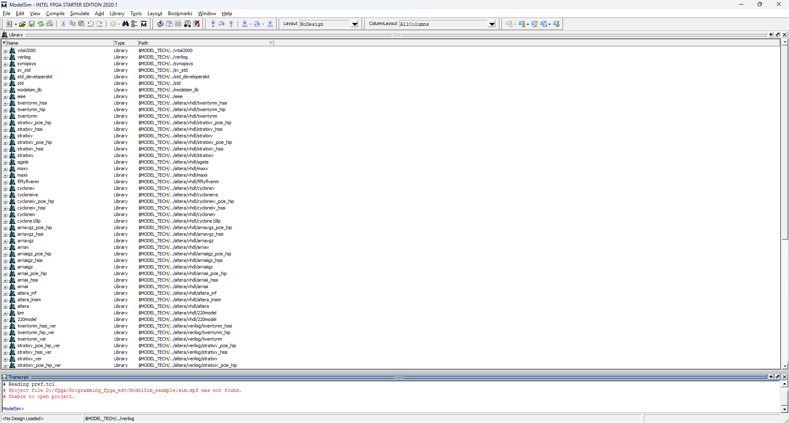

Вначале необходимо изменить папку. Нажимаем `File->Change Directory...` и выбираем папку где будут храниться файлы ModelSim, в данном случае - **modelsim_files**.

#### Создаем библиотеку Gowin. 

Для этого нажтмаем `File->New->Library`.

Откроется окно ввода параметров новой библиотеки:

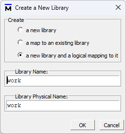

Вводим название библиотеки- Gowin и нажимаеи **OK**. После этого в списке библиотек появится строка:

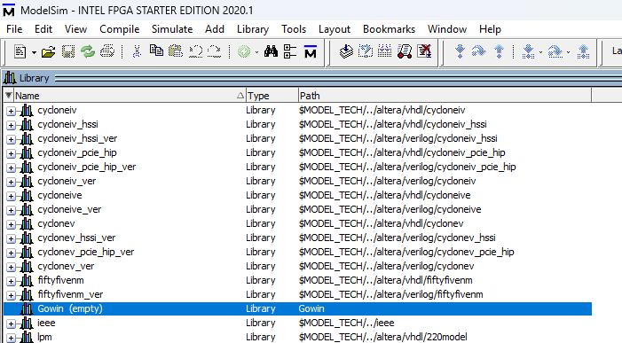

Далее необходимо скомпилировать и добавить в библиотеку файл с примитивами от Gowin. Нажимаем `Compile->Compile`. Откроется окно с выбором файлов для компиляции.

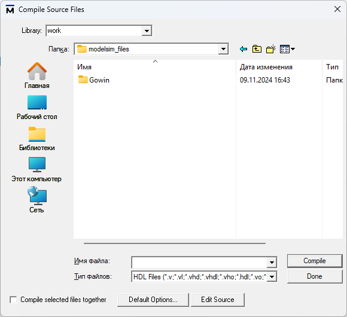

В этом окне необходимо выбрать созданную ранее библиотеку в верхней части:

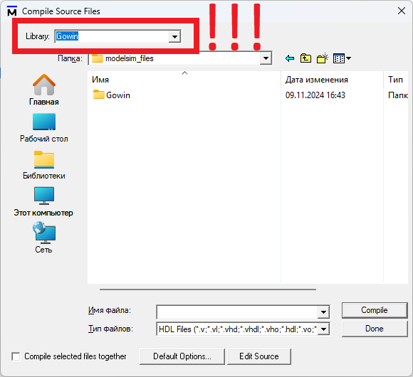

А затем выбрать файл примитивов Gowin:

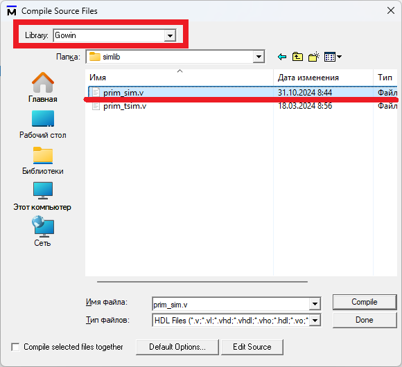

И нажать **Compile**, затем **Done**.

После этого в библиотеке появятся все компоненты, описанные в файле *prim_sim.v*.

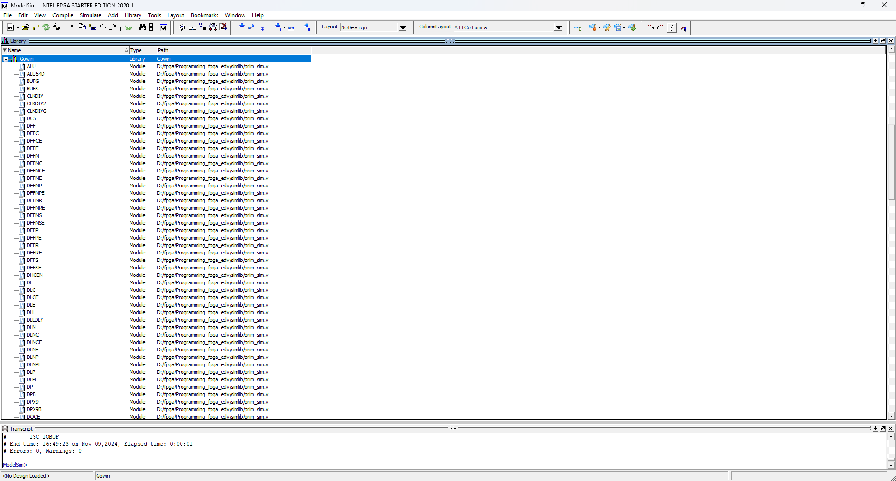

#### Создание проекта симуляции

После подготовки библиотеки можно приступить к созданию проекта симуляции. Для этого нажимаем `File->New->Project`

В открывшемся окне вводим название проекта и название библиотеки, которая будет отображаться в окне MultiSim.

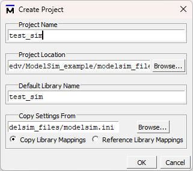

 После этого откроется окно проекта.

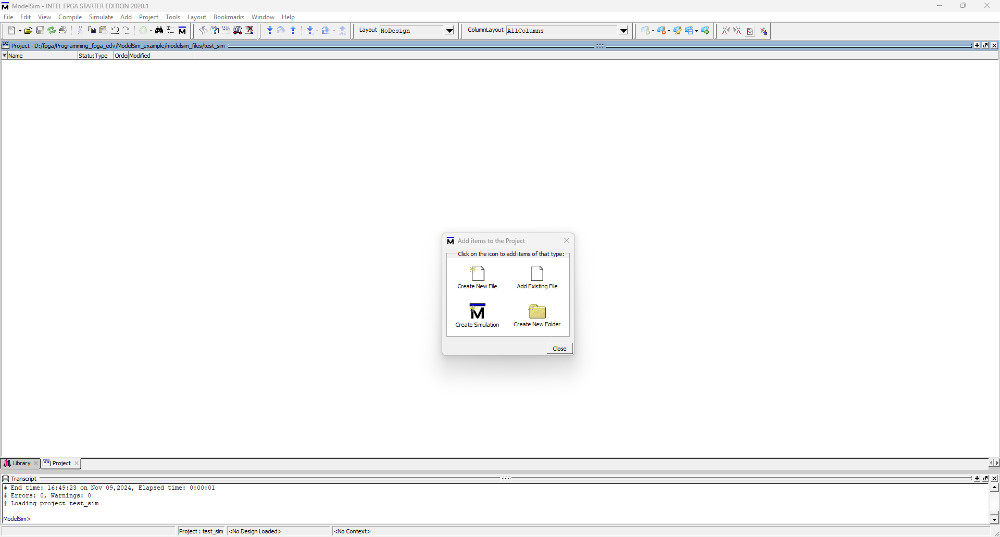

Далее необходимо добавить файлы, которые будут компилирвоаться. Для этого можно в небольшом окне посередине нажать **Add existing Files** или в меню `Project->Add to Project->Existing Files` или через контекстное меню `Add to Project->Existing Files`. Откроется окно

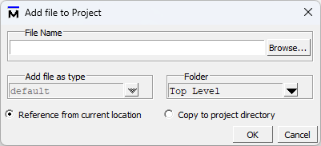

Выбираем файл и нажимаем ОК. 

По одному добавляем все необходимые файлы:

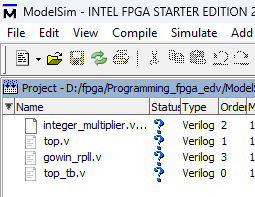

После этого нажимаем `Compile->Compile All`.

#### Симуляция проекта

Для открытия окна симуляции нажимаем `Simulate->Start Simulation`. Откроется окно с выбором проекта.  

Вначале необходимо добавить библиотеку с элементами. для этого переходим во вкладку *Libraries*, нажимаем Add и выбираем созданную ранее библиотеку Gowin.
Затем возвращаемся во вкладку Design, находим проект (**test_sim**) и выбираем файл ***top_tb***, нажимаем OK.
Откроется окно симуляции.

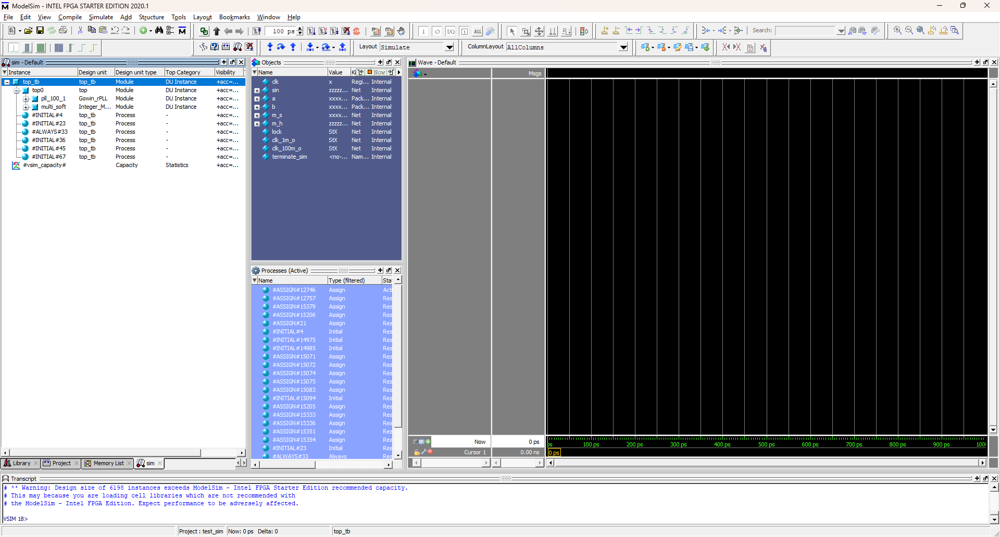

Интерфейс похож на GTKWave. Результат симуляции.

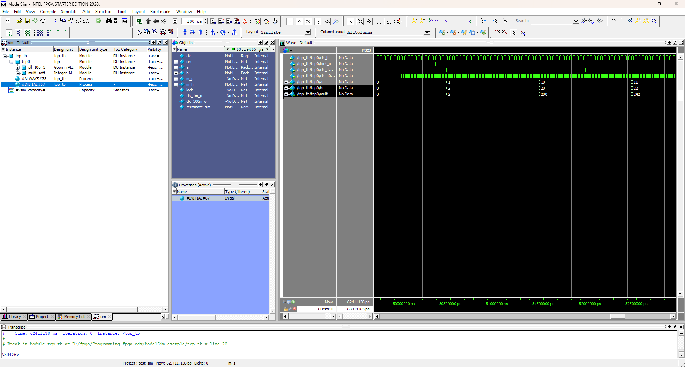

