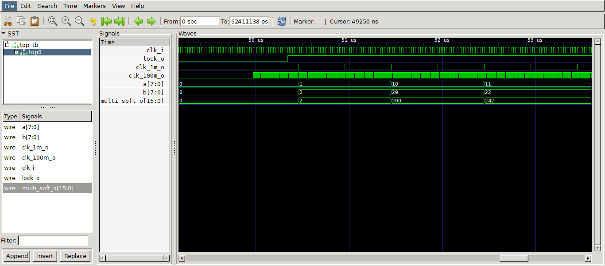

# Симуляция проекта Gowin при помощи iverilog и GTKwave

## Структура папок

<pre>

Название проекта
├─ <b>.vscode</b> - папка с настройками VSCode
│   ├─ <b>settings.json</b> - Параметры для запуска симуляции и определение кнопок для простоты доступа.
│   └─ <b>tasks.json</b> - Описание задач для VSCode.
├─ <b>gw_prj</b> - пример наименования папки с проектом для FPGA
│   ├─ <b>src</b> - Папка с исходными файлами проекта.
│   │   ├─ <b>top.v</b> - <i>Top</i> модуль проекта Gowin.
│   │   ├─ <b>iverilog.cst</b> - Файл <i>Physical constraint</i>.
│   │   └─ <b>gowin_rpll/integer_multiplier</b> - Папки с файлами <i>IP core</i>.
│   └─ <b>iverilog.gprj</b> - Проект Gowin EDA.
├─ <b>compile_files.txt</b> - Список файлов для компиляции <i>iverilog</i>.
├─ <b>top_tb.v</b> - <i>TestBench</i> проекта.
└─ <b>Readme.md</b>.
</pre>

## Структура проекта симуляции

<pre>

top_tb.v
└─ top.v
   ├─ gowin_rpll.v
   └─ integer_multiplier.v
</pre>

## Настройка окружения проекта

Файл ***settings.json***:
```json
{
  "verilog.icarusBuildDirectory": "out",
  "verilog.icarusCompileArguments": "-c compile_files.txt -l../simlib/prim_sim.v", 
  "VsCodeTaskButtons.tasks": [
    {
      "label": "$(window) GTK-wave",
      "task": "Run GTK-wave",
      "tooltip": "View wave"
    },
  ]
}
``` 
Основные моменты:
Строка `"verilog.icarusBuildDirectory": "out"` задает папку для выходных файлов компиляции.

Далее задаются аргументы для самого ***iverilog***. 
1. VSCode работает с iverilog следующим образом - он компилирует открытый файл, и, если требуются другие файлы для компиляции, то их дополнительно необходимо указывать компилятору. Что бы каждый раз не менять настройки, указать файлы можно через дополнительный файл с расширением *txt*. В данном случае это файл - ***compile_files.txt***. Он подключается параметром `-c`. 
2. Для симуляции **IP core** блоков от Gowin компилятору необходимо указать библиотеку элементов Gowin. Она обычно находится по адресу `C:\Gowin\Gowin_V1.X.X.X_x64\IDE\simlib\gw2a\prim_sim.v`. Но для удобства, я скопировал эту библиотеку в репозиторий. Указать библиотеку компилятору можно про помощи параметра `-l`.

В итоге получаем такую строку настройки аргументов iverilog: `"verilog.icarusCompileArguments": "-c compile_files.txt -l../simlib/prim_sim.v"`.

В конце задается кнопка для запуска команды, которая запустит GTKWave.

Файл ***tasks.json***:

Создается задача для запуска GTKWave и в качестве аргументов передается файл из папки *out* c расширением **vcd**. Для других ОС можно заменить `"command": "gtkwave.exe"` на соответствующее название в Вашей ОС.

Файл ***compile_files.txt***:
Указываются файлы участвующие в компиляции проекта. В конце файла обязательно должна быть пустая строка.

Для симуляции файлов **IP Core** необходимо указывать следующие файлы: Для **Hard IP Core** - файл с расширением `.v`, для **Soft IP Core** - файл с расширением `.vo`.

## Процесс разработки проекта

1. Создается проект в Gowin EDA.
2. В папке на уровень выше проекта ПЛИС создается окружение для симуляции (можно и в той же папке, но для удобства лучше разделить проект симуляции и синтезируемый проект).
3. Создается *Testbench*. 
4. Рабочий проект синтезируется и прошивается на ПЛИС.

## Пример

Проект Gowin включающий себя **Hard IP Core** ***PLL*** и **Soft IP Core** ***Multiplier***. PLL из входного частоты генерирует 2 тактовых сигнала - 1МГц и 100МГц. Блок Multiplier умножает 2 числа.

Для тестирования разработан простой TestBench, который лежит на уровень выше, формирует тактовый сигнал для top модуля и передает 2 числа для умножения. Запуск симуляции - запуск testbench. Результат симуляции - 

