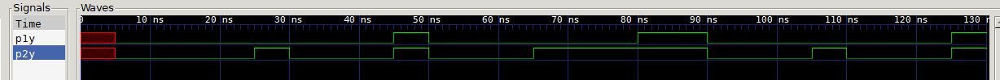

# Лабораторная работа 1

Работа посвящена знакомству с языком verilog и освоение навыков симуляции проектов для ПЛИС.

## Часть 1
Логическая схема.

Требуется разработать модуль, который выполняет функции микросхемы 7458. Микросхема показана на рисунке ниже.

##### Порядок выполнения работы:
Открыть файл **chip_7458.v**. Реализацию работы микросхемы необходимо написать после строки *// write code here*. 
Для проверки правильности работы схемы необходимо открыть файл **chip_7458_tb.v**, запустить компиляцию проекта и открыть приложения просмотра сигналов. 

Результирующие сигналы **p1y** и **p2y** должны соответствовать рисунку:

Результат работы показать преподавателю.

## Часть 2
Арифметические операции.

Требуется разработать модуль реализующий сложение (Full Adder)

Код необходимо писать в файл **full_add.v**, запускать - **full_add_tb.v**

Результирующие сигналы должны соответствовать графику:

## Часть 3 

Требуется разработать модуль сложения для 3х битных сигналов.

Код необходимо писать в файл **full_add_3b.v**, запускать - **full_add_3b_tb.v**

Результирующие сигналы должны соответствовать графику:

