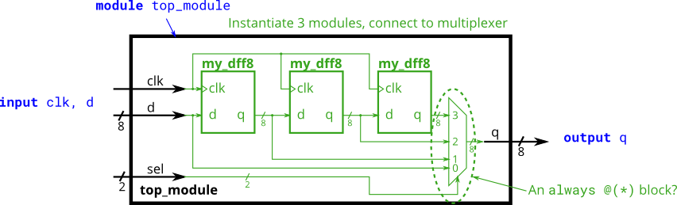

# Лабораторная работа 1

Работа посвящена знакомству с языком verilog и освоение навыков симуляции проектов для ПЛИС.

Все тесты проверяются автоматически, результат будет выведен в терминал.

## Простая комбинаторика

### Часть 1
Логическая схема.

Требуется разработать модуль, который выполняет функции микросхемы 7458. Микросхема показана на рисунке ниже.

##### Порядок выполнения работы:
Открыть файл **chip_7458.v**. Реализацию работы микросхемы необходимо написать после строки *// write code here*. 
Для проверки правильности работы схемы необходимо открыть файл **chip_7458_tb.v**, запустить компиляцию проекта и открыть приложения просмотра сигналов. 

### Часть 2
Арифметические операции.

Требуется разработать модуль реализующий сложение (Full Adder)

Код необходимо писать в файл **full_add.v**, запускать - **full_add_tb.v**

### Часть 3 

Требуется разработать модуль сложения для 3х битных сигналов.

Код необходимо писать в файл **full_add_3b.v**, запускать - **full_add_3b_tb.v**

## Синхронные последовательные схемы

### Часть 1
Требуется разработать модуль D-триггера и собрать схему подключив три триггера последовательно.

Основным модулем является top_module(**part_1_top_module.v**). Модуль триггера можно описать в top или в отдельном файле. Testbench для проверки первой часть - **part_1_dff_tb.v**.

Схема разрабатываемой системы

Результат работы показать преподавателю.

### Часть 2
Требуется разработать модуль D-триггера для 8-битных сигналов и собрать схему подключив три триггера последовательно. Дополнительно необходимо добавить мультиплексор на выходе top модуля.

Основным модулем является top_module(**part_2_top_module.v**). Модуль триггера можно описать в top или в отдельном файле. Testbench для проверки первой часть - **part_2_dff_tb.v**.

Схема разрабатываемой системы

Результат работы показать преподавателю.

### Часть 3

Требуется разработать модуль сложения для 16х битных сигналов и объединить их в общий модуль сложения 32х битных сигналов.

Основным модулем является top_module(**part_3_top_module.v**). Модуль триггера можно описать в top или в отдельном файле. Testbench для проверки первой часть - **part_3_add_tb.v**.

Схема разрабатываемой системы

Результат работы показать преподавателю.

### Часть 4
Модифицируйте top модуль из предыдущей части, что бы получилась следующая схема:

Основным модулем является top_module(**part_4_top_module.v**). Модуль триггера можно описать в top или в отдельном файле. Testbench для проверки первой часть - **part_4_add_tb.v**.

Результат работы показать преподавателю.

### Часть 5
Модифицируйте top модуль из предыдущей части, что бы получилась следующая схема:

[Более подробное описание работы этой схемы](https://en.wikipedia.org/wiki/Adder%E2%80%93subtractor).

Основным модулем является top_module(**part_5_top_module.v**). Модуль триггера можно описать в top или в отдельном файле. Testbench для проверки первой часть - **part_5_add_tb.v**.

Результат работы показать преподавателю.