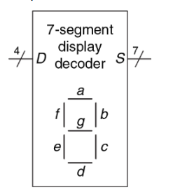
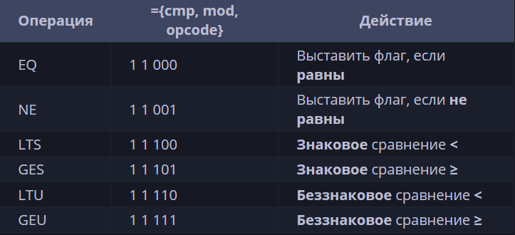

# Лабораторная работа 2

В данной лабораторной работе вам предстоит на основе описания принципа работы схемы описать ее на verilog. В данной работе нет проверки сигналов, вам необходимо разобраться в принципе работы схем, чтобы на основе сигналов понять, правильно ли ваш код синтезировался в схему. Также нет выходных и выходных сигналов, вам нужно будет самим определить их исходя из testbench.

## Синхронизатор
Требуется разработать модуль синхронизатора.

[Более подробное описание работы этой схемы](https://en.wikipedia.org/wiki/Metastability_(electronics)).

Основным модулем является top_module(**sync_top.v**). Testbench для проверки - **sync_top_tb.v**.

Результат работы показать преподавателю.

## ПЗУ
Требуется разработать модуль ПЗУ.

[Более подробное описание работы этой схемы](https://en.wikipedia.org/wiki/Read-only_memory).

Если вкратце о модуле: ПЗУ предназначено для хранения информации, которая записывается на этапе производства или в процессе программирования (ППЗУ) и используется преимущественно для чтения. В зависимости от типа, ПЗУ доступна или только операция чтения (PROM), или также многократная запись (для EPROM, EEPROM и Flash). Чтение производится по адресу.

Из всего этого можно сделать немного простых выводов, во-первых, с помощью специального блока, который может выбирать, во-вторых, что данные задаете вы внутри кода.

Данные выбирайте рандомно, и чтобы все были разные.

Основным модулем является top_module(**rom_top.v**). Testbench для проверки - **rom_top_tb.v**.

Результат работы показать преподавателю.

## Дешифратор для 7-сегметного индикатора

Требуется разработать модуль, который по входной цифре будет выдавать его битовое представление для 7-сегментного индикатора.



Биты идут в таком порядке: abc_defg

Основным модулем является top_module(**sevenseg_top.v**). Testbench для проверки - **sevenseg_top_tb.v**.

Результат работы показать преподавателю.

## ОЗУ
Требуется разработать модуль ОЗУ с асинхронным чтением.

[Более подробное описание работы этой схемы](https://en.wikipedia.org/wiki/Random-access_memory).

Если вкратце о модуле, то в отличие от ПЗУ ОЗУ позволяет считывать и записывать информацию в процессе работы устройства, обеспечивая доступ к временным данным, необходимым для текущей работы системы. Чтение и запись происходит по одному и тому же адресу. Чтение происходит синхронно и только тогда, когда соответствующий порт имеет высокое напряжение. Данные из внешнего выхода передается на внутренний регистр. Чтение происходит либо асинхронно, либо синхронно. 

Из всего этого можно сделать немного простых выводов:

Для того, чтобы записать информацию в такую память необходимо:

- Выставить адрес в который планируется запись данных
- Выставить сами данные для записи на вход чтения
- Установить сигнал в состояние разрешения записи (1)
- Дождаться нужного (положительного, либо отрицательного) фронта clk — в этот момент данные будут записаны по указанному адресу.

Дополнительно к созданию ОЗУ добавьте туда параметры размера регистров и количество регистров, которое считаются как $2^N$, где N - количество бит адреса. Также сделайте так, чтобы нельзя было перезаписать адрес 0 и при обращении по адресу 0 должен выводиться 0.

Небольшая подсказка, описать массив M-битных регистров можно так: 
```verilog 
reg [M-1:0] registers [2^N-1:0];
```

Основным модулем является top_module(**ram_top.v**). Testbench для проверки - **ram_top_tb.v**.

Результат работы показать преподавателю.

## Регистровый файл

Модифицируйте ОЗУ так, чтобы было 2 порта чтения, которые независимы друг от друга, и один порт записи.

В этот раз без параметров, но правило с адресом 0 должно остаться.

Основным модулем является top_module(**file_reg_top.v**). Testbench для проверки - **file_reg_tb.v**.

Результат работы показать преподавателю.

## ALU

Требуется создать Арифметико-логическое устройство.

[Более подробное описание работы этой схемы](https://ru.wikipedia.org/wiki/%D0%90%D1%80%D0%B8%D1%84%D0%BC%D0%B5%D1%82%D0%B8%D0%BA%D0%BE-%D0%BB%D0%BE%D0%B3%D0%B8%D1%87%D0%B5%D1%81%D0%BA%D0%BE%D0%B5_%D1%83%D1%81%D1%82%D1%80%D0%BE%D0%B9%D1%81%D1%82%D0%B2%D0%BE).

Данный блок является комбинационную схемой.

Разница между арифметическими и логическими операциями в отсутствии у последних бита переноса, так как логические операции происходят между 1-битными числами и дают 1-битный результат, а в случае АЛУ (в рамках данной лабораторной работы) одновременно между 32-мя 1-битными парами чисел. В логических операциях результаты значений отдельных битов друг с другом никак не связаны.

Также, кроме результата операций, АЛУ может формировать специальные сигналы-флаги, которые показывают выполняется ли заданное условие. Например, выводить 1, если один операнд меньше другого, или если в результате суммы произошло переполнение.

По данной таблице опишите 32-битный ALU на Verilog




Основным модулем является top_module(**alu_top.v**). Testbench для проверки - **alu_top_tb.v**.

Результат работы показать преподавателю.

## LUT

Требуется создать таблицу подстановки.

Более подробное описание работы этой схемы будет описано на 3 лекции.

В этом задании вам предстоит разработать схему для памяти 8x1, в которой запись осуществляется путём сдвига битов по сигналу разрешения, а чтение — «random access», как в ОЗУ.

Сначала создайте 8-битный регистр сдвига с 8 D-триггерами. Обозначьте выходы триггеров Q[0]...Q[7]. Вход регистра сдвига должен быть обозначен как S, он поступает на вход Q[0] (старший бит сдвигается первым). Вход разрешения управляет сдвигом. Затем добавьте в схему 3 дополнительных входа A, B, C и выход Z. Схема должна вести себя следующим образом: когда ABC равен 000, Z=Q[0], когда ABC равен 001, Z=Q[1] и так далее. Ваша схема должна содержать ТОЛЬКО 8-битный регистр сдвига и мультиплексоры.

Кроме создания LUT вам нужно определить 3 функции из testbench.

Основным модулем является top_module(**lut_top.v**). Testbench для проверки - **lut_top_tb.v**.

Результат работы показать преподавателю.