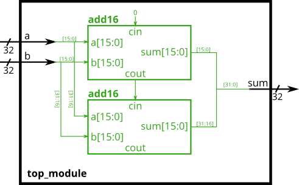

# Лабораторная работа 2

Разработка и подключение модулей.

## Часть 1
Требуется разработать модуль D-триггера и собрать схему подключив три триггера последовательно.

Основным модулем является top_module(**part_1_top_module.v**). Модуль триггера можно описать в top или в отдельном файле. Testbench для проверки первой часть - **part_1_dff_tb.v**.

Схема разрабатываемой системы

Результат работы показать преподавателю.

## Часть 2
Требуется разработать модуль D-триггера для 8-битных сигналов и собрать схему подключив три триггера последовательно. Дополнительно необходимо добавить мультиплексор на выходе top модуля.

Основным модулем является top_module(**part_2_top_module.v**). Модуль триггера можно описать в top или в отдельном файле. Testbench для проверки первой часть - **part_2_dff_tb.v**.

Схема разрабатываемой системы

Результат работы показать преподавателю.

## Часть 3 

Требуется разработать модуль сложения для 16х битных сигналов и объединить их в общий модуль сложения 32х битных сигналов.

Основным модулем является top_module(**part_2_top_module.v**). Модуль триггера можно описать в top или в отдельном файле. Testbench для проверки первой часть - **part_2_dff_tb.v**.

Схема разрабатываемой системы

Результат работы показать преподавателю.

## Часть 4 Часть 5
(work in progress)