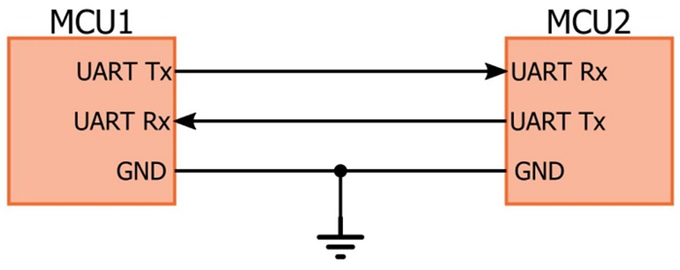
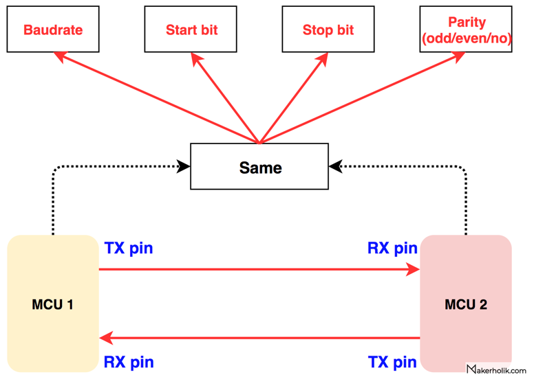
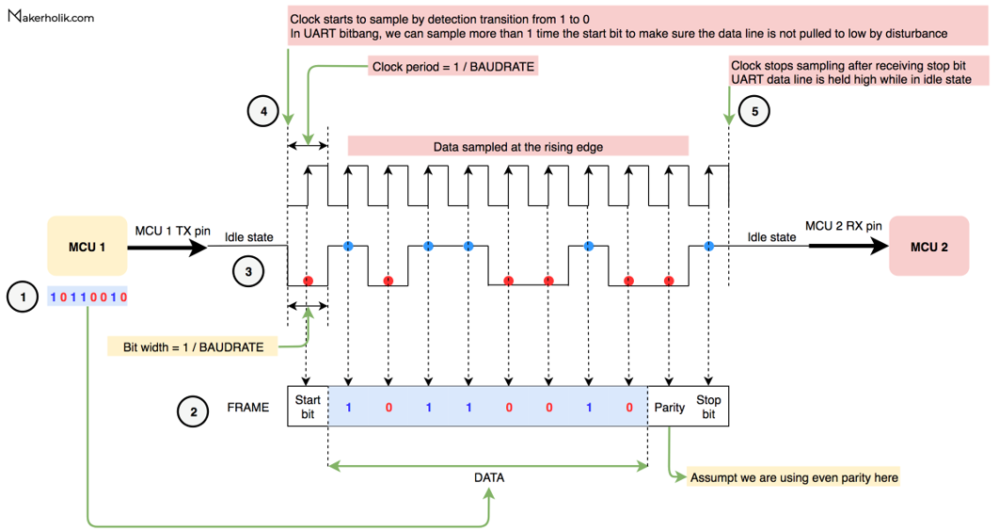

# Памятка по разработке UART

Для разработки UART нужно будет создать 2 модуля, а именно приемник и транслятор, или RX и TX порты.

Их принцип работы прост. Они имеют одинаковый Baudrate, Start\Stop bit и одинаковый parity bit.

Принцип работы RX таков: 

1) Вы ждете когда ваша линия с высокого состояния перейдет на низкое, отсчитываете один тик вашего CLK для UART.
2) Дальше вы CLK для UART отсчитываете 8 бит.
3) Если у вас parity bit вы отсчитываете его.
4) И последним шагом вы отсчитываете Stop bit.

Ну а TX это то же самое, только вы сами генерируете эти условия.

Но прежде чем их реализовывать необходимо разработать его FSM.

Из условий выше можно сделать вывод, что есть 4 состояния:

1) Idle
2) Start
3) Sample
4) Stop

Переходы между ними можно также легко восстановить из условий выше.

Удачи!
