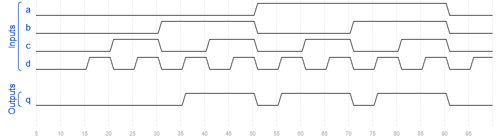
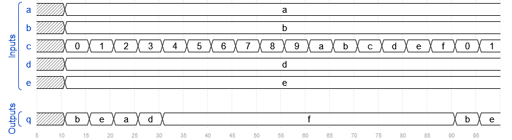
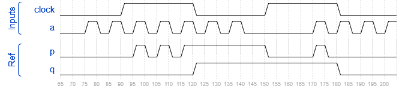
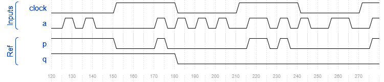
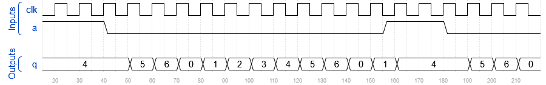

# Лабораторная работа 3

Анализ временных диаграмм и разработка testbench.

Прочитайте формы сигналов моделирования, чтобы определить, что делает схема, а затем реализуйте её и testbench для проверки правильности выполнения схемы.

## Часть 1
Это комбинационная схема.

## Часть 2
Это комбинационная схема.

## Часть 3
Это комбинационная схема.

## Часть 4
Это последовательная схема.

## Часть 5
Это последовательная схема.

## Часть 6
Это последовательная схема. Схема состоит из комбинационной логики и одного бита памяти (т.е. одного триггера). Выход триггера передается через wire *state*.

