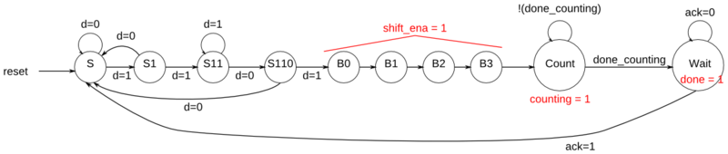

# Лабораторная работа 4

Знакомство с машинами состояний(Finite state machine - FSM) и разработка больших схем. 
Примеры описания и обработки FSM приведены в папке - **FSM examples**;

Глобальная задача работы - разработка продвинутого таймера, который работает следующим образом: 
1. запускается при обнаружении определенного шаблона (1101),
2. сдвигает еще 4 бита для определения длительности задержки,
3. ждет, пока счетчики закончат подсчет, и
4. уведомляет пользователя и ждет, пока пользователь не отправит сигнал подтверждения.

Основой данного таймер будет служить FSM.

Схема

Машина состояний:

Временная диаграмма:

Для упрощения реализации такого таймера, разобьем разработку на этапы. 

Для каждого этапа необходимо разработать TestBench.

## Часть 1
Необходимо разработать счетчик, который считает от 0 до 999 включительно. Вход *reset* синхронный и должен сбросить счетчик на 0.

## Часть 2
Разработайте четырехбитный сдвиговый регистр, который также действует как счетчик обратного счета. Данные сдвигаются по принципу most-significant-bit first по сигналу *shift_ena* (*shift_ena* = 1). 
Когда *count_ena* = 1 текущее число в сдвиговом регистре уменьшается. Поскольку полная система никогда не использует *shift_ena* и *count_ena* вместе, не имеет значения, что делает ваша схема, если оба управляющих входа равны 1.

## Часть 3
Разработайте конечный автомат, который ищет последовательность **1101** во входном потоке битов. Когда последовательность найдена, он должен установить *start_shifting* =  1  до сброса.

## Часть 4
Реализуйте таймер, описанный в начале данной ЛР. 

Последовательные данные поступают на линию *data*. Когда получен шаблон **1101**, схема включает сдвиговый регистр, и считывает 4 бита с линии *data*. Эти 4 бита определяют длительность задержки таймера - *delay [3:0]*.

Затем FSM переходит в режим счета. При этом на линию *counting* выставляется высокий уровень. Таймер должен отсчитать количество тактов, равное *(delay + 1)\*1000*, т.е. для *delay=0* таймер считает 1000 тактов, для *delay=1* - 2000 тактов, и тд.

После того, как задержка выдержана, линия *done* устанавливается в высокое состояние, а линия *counting* в 0. 

 При получении подтверждения от пользователя (*ack* = 1) cхема должна сброситься в начальное состояние, в котором она начинает поиск последовательности входа 1101.

