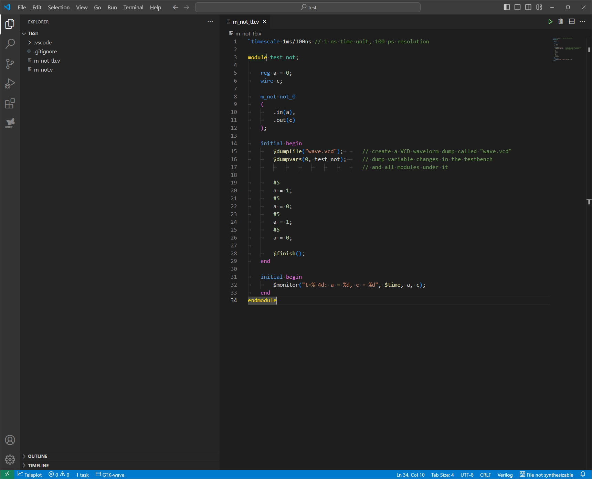
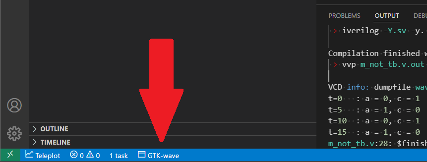
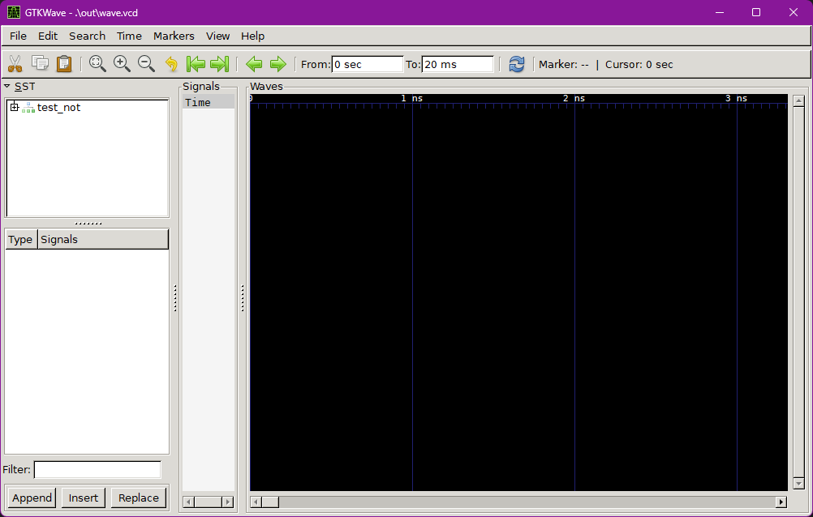
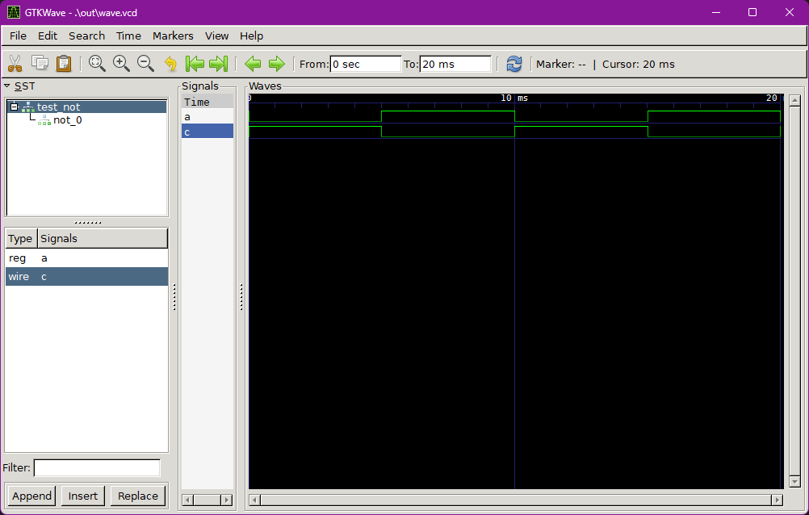

# Программирование ПЛИС

Курс посвящен введению в разработку систем основанных на ПЛИС.

## Необходимое ПО
 1. Icarus Verilog - Скачать можно [тут](https://bleyer.org/icarus/);
 2. Visual Studio Code - [ссылка](https://code.visualstudio.com/download);
 3. Дополнения VS Code:
     * Task Buttons v1.1.3;
     * Verilog Testbench Runner v1.0.3;
     * Verilog-HDL/SystemVerilog/Bluespec SystemVerilog;
     * Output colorizer.

**При установке iverilog обязательно поставьте галочку "Add executable folder(s) to the PATH"!**

## Проверка что все работает

##### Запуск симуляции
После установки ПО и всех дополнений, запустите VSCode и в нем откройте папку (Open Folder) **test**. Откройте файл **m_not_tb.v**. 
Внешний вид окна (картинки кликабельны):



Нажмите кнопку запуска (*Compile and run testbench*) выбранного файла (расположена в верхнем правом углу):


Должно будет появится поле *Output* со следующим результатом:
```shell
 > iverilog -Y.sv -y.  -o out\m_not_tb.v.out m_not_tb.v 

Compilation finished with exit code 0
 > vvp m_not_tb.v.out 

VCD info: dumpfile wave.vcd opened for output.
t=0   : a = 0, c = 1
t=5   : a = 1, c = 0
t=10  : a = 0, c = 1
t=15  : a = 1, c = 0
m_not_tb.v:28: $finish called at 200000 (100ns)
t=20  : a = 0, c = 1
Execution finished with exit code 0
```

Если что-то не так, обратитесь к преподавателю.

##### Просмотр сигналов
После запуска симуляции можно запустить программу GTk-wave для просмотра сигналов. Для этого нажмите кнопку *GTK-wave* внизу экрана.



Запустится окно программы



В области *SST* отображены все модули и подмодули. Чтобы добавить сигнал для просмотра необходимо выбрать модуль и в поле ниже выбрать интересующий сигнал. Двойным щелчком можно добавить сигнал. После выбору интересующих сигналов, для изменения маштаба можно воспользоваться кнопками в меню *Time->Zoom*, например отобразить всю временную область - *Time->Zoom->Zoom Best Full*. 

Окно с сигналами будет выглядеть следующим образом

